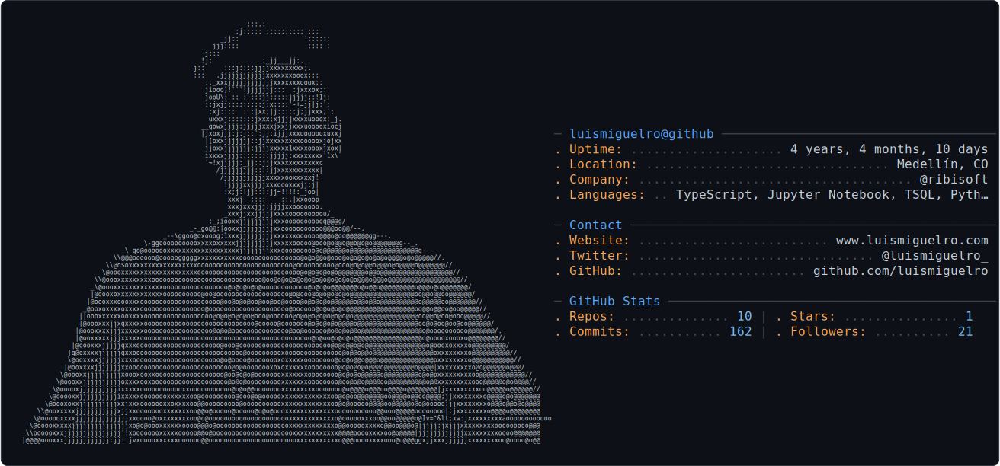

<picture>
  <source media="(prefers-color-scheme: dark)" srcset="dark_mode.svg" />
  <source media="(prefers-color-scheme: light)" srcset="light_mode.svg" />
  
</picture>

 

---

### 👋 Hola, soy Luis Miguel

Data Engineer & BI Developer en Medellín 🇨🇴. Construyo pipelines end-to-end, modelos de ML en producción y dashboards que convierten datos empresariales en decisiones reales.

- ⚽ El Mundial 2026 está **en juego** y mi modelo lo predice en vivo → [mundial-predictor-zeta.vercel.app](https://mundial-predictor-zeta.vercel.app)
- ⚡ Optimicé queries sobre **2.2M filas** de un ERP farmacéutico: −99.3% de lecturas con execution plans antes/después
- 📊 +2 años y **+50 dashboards** transformando datos en decisiones para PyMEs colombianas: combustibles ⛽, farmacias 💊, construcción 🏗️, retail 🛍️
- 💡 Fun fact: creo que un buen README vale tanto como el código

---

### 🚀 Proyectos Destacados

| | |
|---|---|
| **⚽ [Mundial Predictor 2026](https://github.com/luismiguelro/mundial-predictor)** · [demo en vivo](https://mundial-predictor-zeta.vercel.app) | **⚡ [SQL Performance Lab](https://github.com/luismiguelro/sql-performance-lab)** |
| Predictor ML del Mundial FIFA 2026: modelo de goles Dixon-Coles, ELO propio y Monte Carlo del torneo completo. Integra los resultados oficiales en vivo: el modelo se confronta con la realidad partido a partido. | Auditoría de rendimiento sobre ERP farmacéutico real: 3 anti-patrones diagnosticados y corregidos con benchmarks cold-cache y execution plans antes/después. |
| `Python` `Dixon-Coles` `Monte Carlo` `Next.js 15` `Recharts` | `SQL Server 2022` `T-SQL` `Columnstore Index` `Query Optimization` |
| 🎯 Backtest Qatar 2022: 0.53 accuracy (azar: 0.33) · 45 tests · 3 idiomas | 📉 2.2M filas · −59% tiempo · −99.3% lecturas (2,856 → 19) |
| **✈️ [Flight Price Intelligence](https://github.com/luismiguelro/flight-price-intelligence)** | **🛒 [Retail Intelligence Pipeline](https://github.com/luismiguelro/retail-intelligence-pipeline-)** |
| ¿Compro el vuelo hoy o espero? Pipeline ML que consulta Google Flights en tiempo real y emite señal de compra con % de confianza. | Pipeline completo de merchandising: dónde ubicar productos en góndola y qué referencias tienen mayor revenue potencial. |
| `XGBoost` `FastAPI` `MLflow` `Streamlit` `Supabase` | `dbt Core` `PostgreSQL` `Streamlit` `GitHub Actions` |
| 📈 R² 0.97 · MAE 2,088 INR · 300k vuelos | ✅ 52/52 dbt tests PASS · Star schema |

---

### 🧰 Stack

#### 📊 BI & Analytics

#### ⚙️ Data Engineering & ML

#### 🗄️ Bases de Datos

#### 🌐 Web

#### 🛠️ Herramientas

---

### 📈 GitHub Stats

---

*Construido con datos, desplegado con propósito.*

